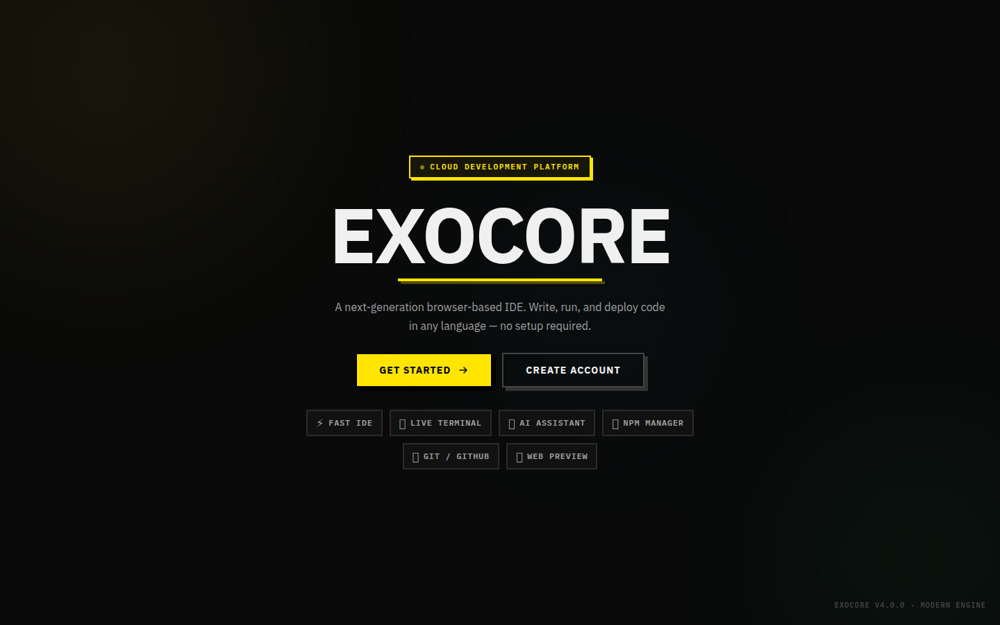
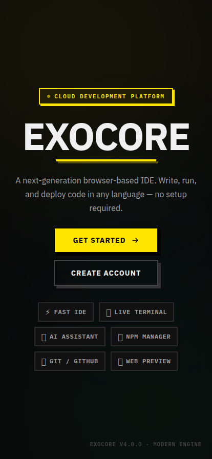
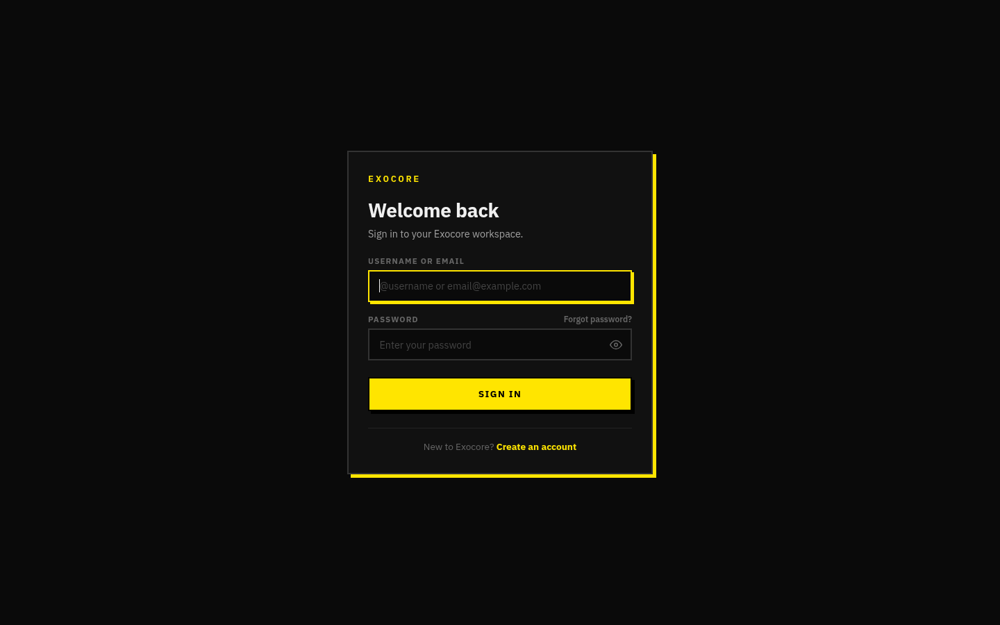
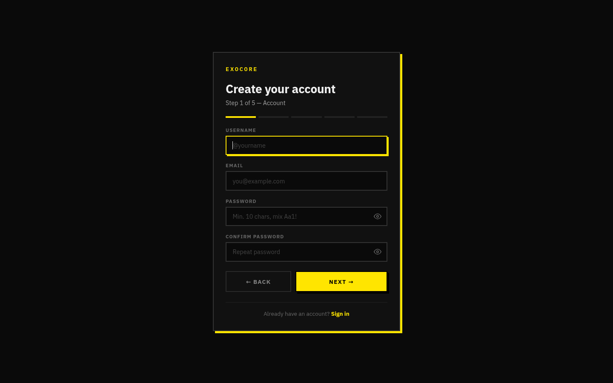
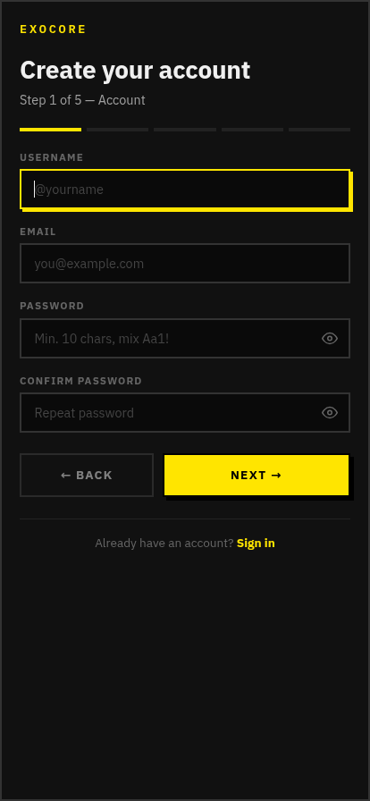
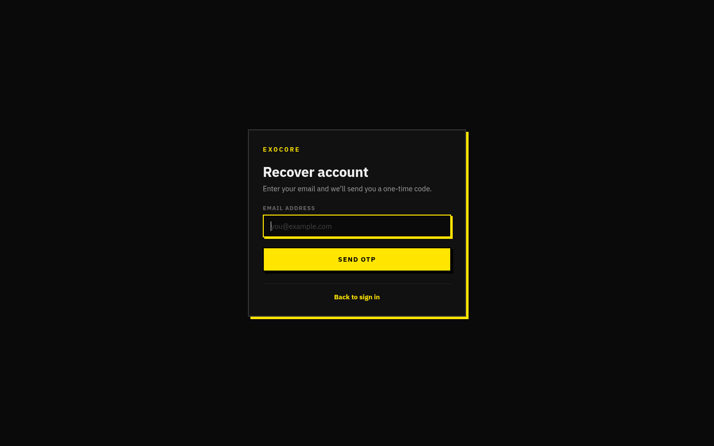
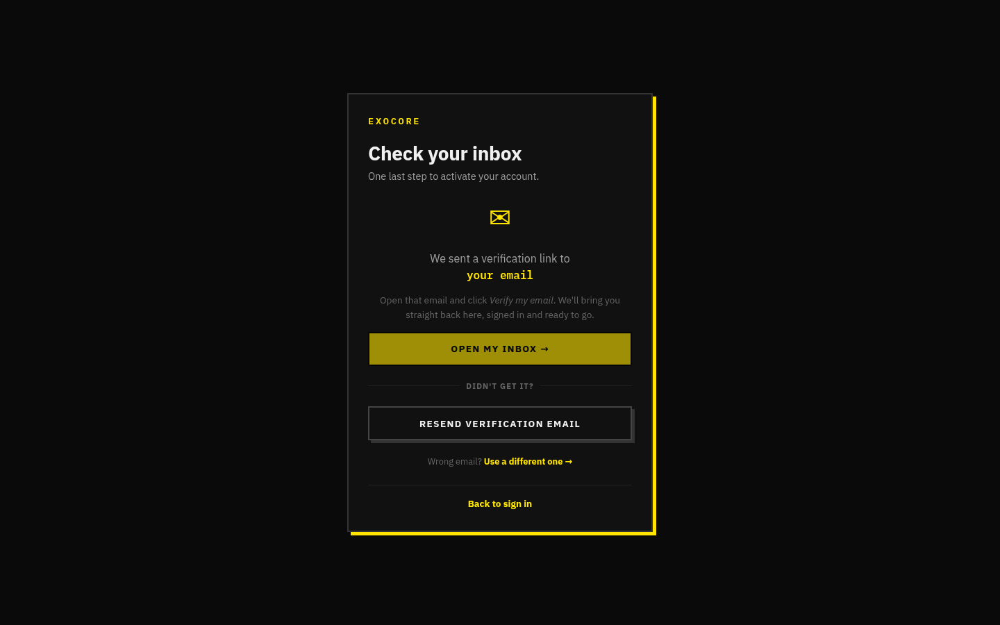
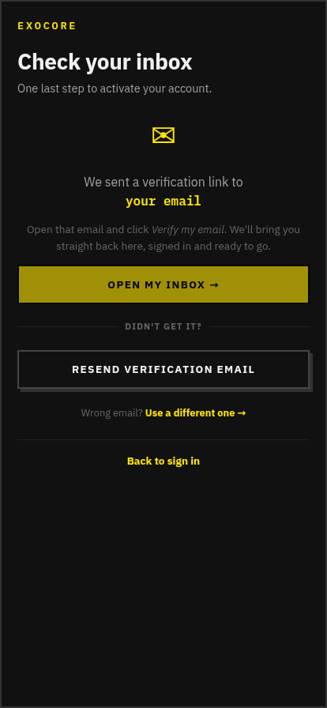

# Authentication Flow

Once the panel-devs gate is unlocked, the SPA exposes a complete user-account
flow backed by **`Exocore-Backend`** (email-verified accounts, Google Drive
hashed at rest, OAuth). All five auth screens render with the same dark
neon-yellow brand and share `access/components/AuthLayout.tsx`.

## Files

| Route | Component |
|-------|-----------|
| `/exocore/`              | [`access/auth/Home.tsx`](../../client/access/auth/Home.tsx) |
| `/exocore/login`         | [`access/auth/Login.tsx`](../../client/access/auth/Login.tsx) |
| `/exocore/register`      | [`access/auth/Register.tsx`](../../client/access/auth/Register.tsx) |
| `/exocore/forgot`        | [`access/auth/Forgot.tsx`](../../client/access/auth/Forgot.tsx) |
| `/exocore/verify-pending`| [`access/auth/VerifyPending.tsx`](../../client/access/auth/VerifyPending.tsx) |
| `/exocore/auth/callback` | [`access/auth/AuthCallback.tsx`](../../client/access/auth/AuthCallback.tsx) |

The user token (`exo_token`) is stored in `localStorage` and is rebroadcast on
every `/exocore/api/*` axios request via the global interceptor in
`access/panelAuth.ts`.

---

## 1. Home (landing) — `/exocore/`

The first screen a visitor sees after the panel-devs gate. Pure marketing:
brand, tagline, two CTAs (`Get Started` → `/login`, `Create Account` →
`/register`) and feature pills (Fast IDE, Live Terminal, AI Assistant,
NPM Manager, Git/GitHub, Web Preview).

| Desktop | Mobile |
|---------|--------|
|  |  |

If `localStorage.exo_token` is already present, `useEffect` redirects to
`/dashboard` — repeat visitors skip this page entirely.

---

## 2. Login — `/exocore/login`

Two-field sign in (username **or** email + password) with show-password eye
toggle, "Forgot password?" link, and an inline "Create an account" footer
link.

| Desktop | Mobile |
|---------|--------|
|  |  |

Submission calls `POST /exocore/api/auth/login` (proxied to the backend).
On success the token is stamped into `localStorage.exo_token` and the user is
forwarded to `/dashboard`. Failures show a red banner inside the card.

---

## 3. Register — `/exocore/register`

Multi-step account creation: username, email, password (with strength meter),
country, optional avatar upload. Validation is real-time (Zod-ish hand-rolled
checks) and the `Create account` button is disabled until every field passes.

| Desktop | Mobile |
|---------|--------|
|  |  |

After submit, the backend sends a verification e-mail and the SPA pushes the
user to `/verify-pending`.

---

## 4. Forgot password — `/exocore/forgot`

Single email input. Submitting calls
`POST /exocore/api/auth/forgot` which dispatches a one-time reset code to the
mail address. The page then asks for the code + new password inline (no
extra route — same component swaps state).

| Desktop | Mobile |
|---------|--------|
|  |  |

---

## 5. Verify pending — `/exocore/verify-pending`

Holding screen shown right after sign-up. Polls
`GET /exocore/api/auth/verify/status?email=…` every few seconds and
auto-forwards to `/login` once the user clicks the link inside the
verification mail. Buttons: **Resend e-mail**, **Change e-mail**, **Back**.

| Desktop | Mobile |
|---------|--------|
|  |  |

---

## 6. OAuth callback — `/exocore/auth/callback`

Tiny landing page used by Google OAuth (and any future provider). Reads the
`?token=` query string set by the backend redirect, persists it via
`setPanelToken`, and `navigate('/dashboard')`. No screenshot needed — it
flashes for less than a second.

---

## Backend touchpoints

| Endpoint                                  | Used by |
|-------------------------------------------|---------|
| `POST /exocore/api/auth/register`         | Register |
| `POST /exocore/api/auth/login`            | Login |
| `POST /exocore/api/auth/forgot`           | Forgot |
| `POST /exocore/api/auth/verify`           | Verify-pending poll |
| `GET  /exocore/api/auth/userinfo`         | Bootstrapped by Dashboard |
| `GET  /exocore/api/auth/audit`            | Account / security tab |
| `DELETE /exocore/api/auth/delete`         | Account → Delete account |
