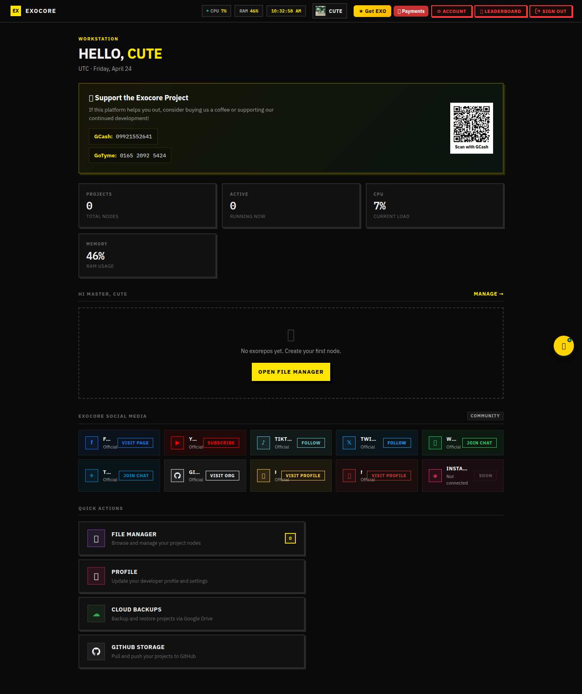
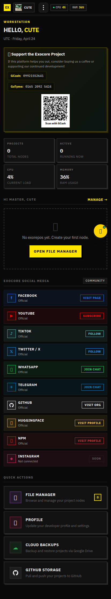

# Cloud Backups — Google Drive integration

Exocore mirrors all panel state to a private folder on the **owner's Google
Drive** so that you can wipe / re-deploy the server and restore everything in
seconds. The client side lives in
[`home/GDriveManager.tsx`](../../client/home/GDriveManager.tsx) (modal opened
from the dashboard's `☁ Cloud Backups` quick action) plus
[`editor/GDrivePane.tsx`](../../client/editor/GDrivePane.tsx) (Drive sidebar
inside the IDE).

## What gets synced

| Backend file                          | What it stores |
|---------------------------------------|----------------|
| `Exocore-Backend/local-db/users.enc`  | All user accounts (encrypted at rest) |
| `Exocore-Backend/local-db/posts.json` | Public posts feed |
| `Exocore-Backend/local-db/dms.*`      | Direct messages |
| `Exocore-Backend/local-db/global-chat.json` | Global chat backlog |
| `Exocore-Backend/local-db/token.enc`  | OAuth bootstrap |
| `client/access/devs.json`             | Panel-devs master account |

A background loop in
[`Exocore-Backend/src/services/drive.ts`](../../Exocore-Backend/src/services/drive.ts)
checks every 60 s, uploads diffs, and emits cache-restore events on boot
(`[cache] restoring from Drive…`).

## Manager modal — desktop / mobile

Opened from `Dashboard → Quick Actions → Cloud Backups`. Sections:

```
┌─ Connected account ──────────────┐
│  📷 Google avatar  email · plan  │
│  Disk used: 4.2 GB / 15 GB        │
│  [ Re-authorize ]  [ Disconnect ] │
├─ Sync status ────────────────────┤
│  ✅ users.enc        2 s ago      │
│  ✅ posts.json       2 s ago      │
│  🔄 dms.*            uploading…   │
│  ⚠️ tokens.enc       error: …     │
├─ Manual actions ─────────────────┤
│  [ ⬆ Force upload ]  [ ⬇ Pull now ]│
│  [ 🗑 Reset cloud cache ]          │
└──────────────────────────────────┘
```

(Same dashboard capture applies — the modal opens on top of it once a user is
authenticated.)

| Desktop | Mobile |
|---------|--------|
|  |  |

## OAuth flow

1. User clicks **Connect Google Drive** → server redirects to Google's consent
   screen with the `drive.file` scope.
2. Google redirects back to `/exocore/api/oauth/google/callback`.
3. Server exchanges the code, encrypts + writes the refresh token to
   `Exocore-Backend/local-db/token.enc`.
4. Sync loop boots and walks the `EXOCORE_BACKUPS` parent folder.

## RPC + HTTP touchpoints

| Channel / route                           | Purpose |
|-------------------------------------------|---------|
| RPC `drive.status`                        | Connected account + per-file last-sync ts |
| RPC `drive.sync`                          | Force a full upload pass |
| RPC `drive.pull`                          | Replace local cache with Drive copy |
| RPC `drive.disconnect`                    | Revoke + clear local token |
| HTTP `POST /exocore/api/editor/gdrive/*`  | IDE-side file picker (proxied to backend Drive scope) |
