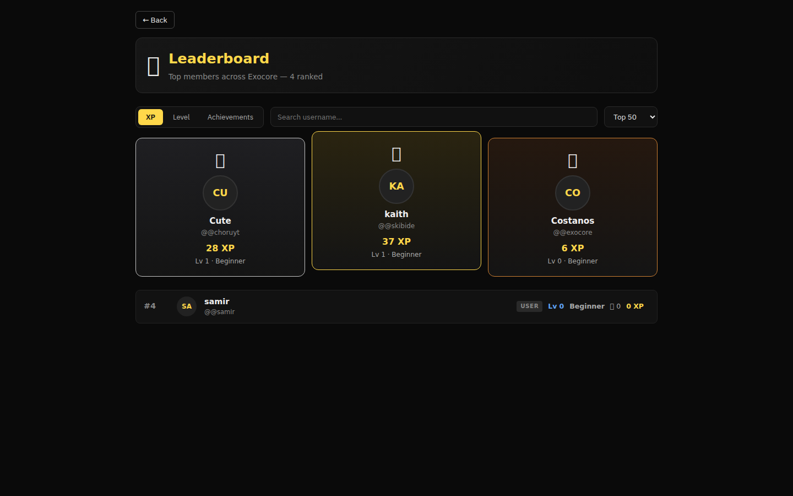
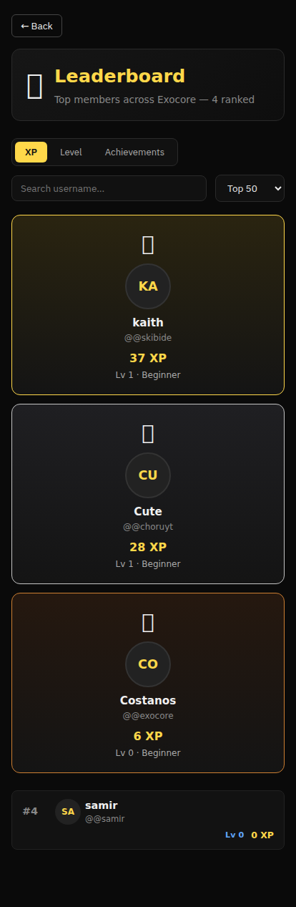

# Leaderboard — `/exocore/leaderboard`

Top members across the Exocore server, ranked across three dimensions you can
toggle in the header. Component:
[`client/leaderboard/Leaderboard.tsx`](../../client/leaderboard/Leaderboard.tsx).

| Desktop | Mobile |
|---------|--------|
|  |  |

## What you see in the capture

The capture run shows the **live data** on this server right now (4 users):

| Rank | Avatar | Nickname | Username | XP | Lv |
|------|--------|----------|----------|----|----|
| 🥇 1 | KA | **kaith**    | `@@skibide` | 37 XP | Lv 1 — Beginner |
| 🥈 2 | CU | **Cute**     | `@@choruyt` | 28 XP | Lv 1 — Beginner |
| 🥉 3 | CO | **Costanos** | `@@exocore` |  6 XP | Lv 0 — Beginner |
| 4   | SA | **samir**    | `@@samir`   |  0 XP | Lv 0 — Beginner |

The top 3 are rendered as the **podium** (large cards with halo / glow), the
rest fall into a flat list underneath.

## Header controls

```
[ XP | Level | Achievements ]   [ search… ]   [ Top 50 ▾ ]
```

- **XP / Level / Achievements** — switches the sort dimension.
- **search** — fuzzy filter on `nickname` and `@username`.
- **Top N** — limit dropdown: `10`, `50`, `100`, `All`.

## RPC

```ts
rpc.call("xp.leaderboard", {
   sort: "xp" | "level" | "achievements",
   limit: 10 | 50 | 100 | -1,
   query: string
})
   ↪︎ { entries: LeaderboardEntry[], total: number, generatedAt: number }
```

Backend handler lives at
[`Exocore-Backend/src/auth/leaderboard.ts`](../../Exocore-Backend/src/auth/leaderboard.ts);
it pulls from the encrypted user store + computes XP-to-level using the
shared formula in `xpService.ts`.

## Click behaviour

Clicking any card or row calls `navigate(/u/${entry.username})` →
[Profile](../profile/README.md).

## Empty / loading

| State | Render |
|-------|--------|
| Loading | spinner + "Crunching ranks…" |
| No matches | "No members match `<query>`." |
| API down | red banner + retry button |
