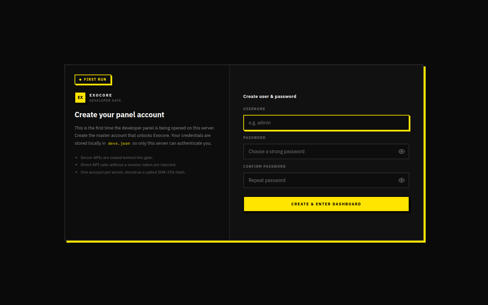
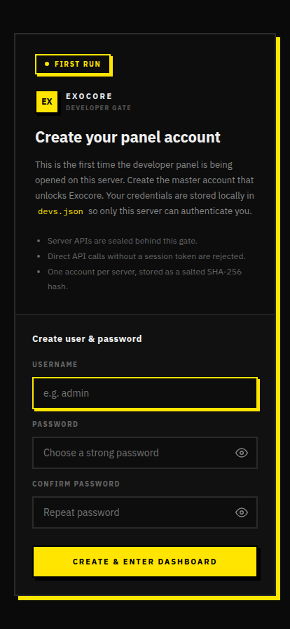

# Panel Devs Gate

Every request that reaches `/exocore/*` first hits the **panel-devs gate**
(see [`client/access/panel-devs.tsx`](../../client/access/panel-devs.tsx) +
[`server/lib/devGate.ts`](../../server/lib/devGate.ts)).

It guards the workspace with a **single master account per server**, persisted
to `client/access/devs.json` as a salted SHA-256 hash. No request is allowed
through to the backend hub until you hold a valid session token.

## States

| State | When it shows | Visual |
|-------|--------------|--------|
| `setup` | First time the panel is opened on this server (`devs.json` is missing) | Yellow `FIRST RUN` badge, three input form (user / pass / confirm) |
| `login` | `devs.json` exists, no valid session token in IndexedDB | Green `READY` badge, two input form (user / pass) |
| `authenticated` | Valid session token found | Forwards to the SPA, also paints the IP-change alarm banner |

## Desktop

### Setup (first run)

### After unlock (returns "Welcome back" on subsequent visits)

The same screen appears with a green **READY** badge and two inputs after the
master account is created.

## Mobile

## Security highlights

- One account per server — re-create by deleting `devs.json` on the host.
- Server APIs are sealed behind this gate; un-tokenised hits are rejected.
- Brute-force lockout: too many failed RPC `devAccess.login` calls returns
  `429` with a `retryAfterSec` countdown that the UI displays under the form.
- IP-change alarm — when your session's IP differs from the last known one,
  a banner is rendered across every panel page (`PanelIpAlarm` in the same
  file).
- Session tokens are stored client-side in **idb-keyval** (IndexedDB) under
  `exocore_panel_token`, so they survive reloads but never touch
  `localStorage`.

## RPC channels used

| Channel | Purpose |
|---------|---------|
| `devAccess.status` | Returns `{ initialized: boolean }` to pick `setup` vs `login` |
| `devAccess.setup`  | Creates `devs.json` and returns the first session token |
| `devAccess.login`  | Validates credentials → returns a session token |
| `devAccess.me`     | Quick "is this token still valid?" check |
| `devAccess.session`| Returns session metadata (last IP, UA, expiry) |
| `devAccess.logout` | Revokes the token server-side |

(Implemented in
[`server/rpc/devAccessHandlers.ts`](../../server/rpc/devAccessHandlers.ts).)
