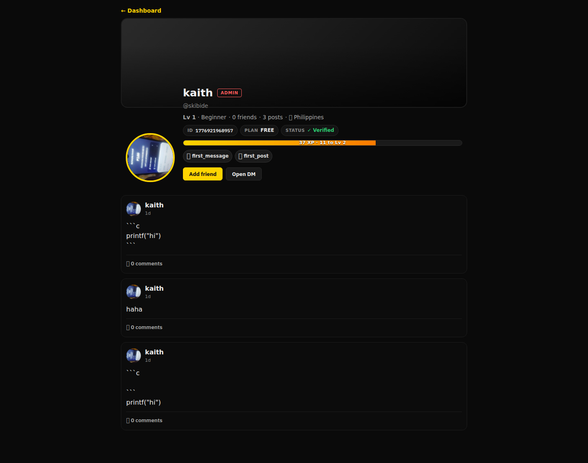
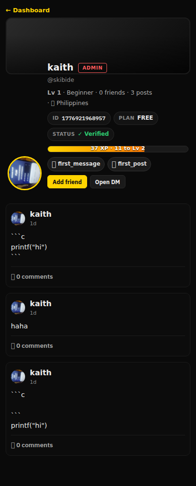
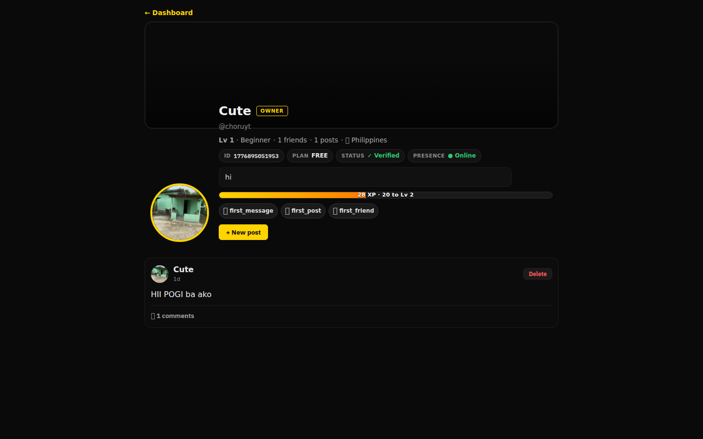
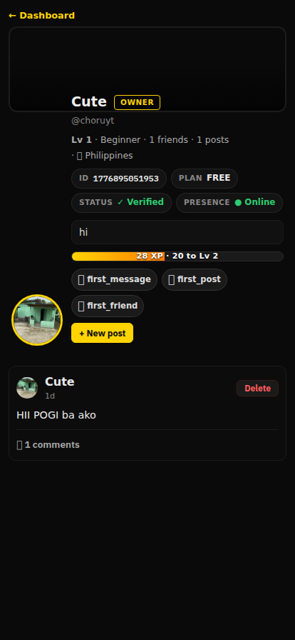

# Profile — `/exocore/u/:username`

The Profile view is half **Twitter-style timeline** and half **stalker page**.
Same component renders for visitors and the logged-in user; the action row
swaps between *post composer* (own page) and *Friend / Message* buttons
(stalk mode).

Source: [`client/profile/Profile.tsx`](../../client/profile/Profile.tsx)
(~600 LOC, also wires post creation, comments, reactions and friend
add/remove).

---

## Stalking another user — `@skibide` (3 posts, ADMIN role)

| Desktop | Mobile |
|---------|--------|
|  |  |

## Top contributor — `@exocore` (the OWNER)

| Desktop | Mobile |
|---------|--------|
|  |  |

---

## Anatomy

```
┌─ ← Back to Dashboard ──────────────────────────────┐
│  Cover banner (gradient) ──────────────────────────│
│        ┌──────────┐                                │
│        │  Avatar  │  Nickname     [ROLE chip]      │
│        └──────────┘  @username                     │
│                       Lv N · Title · Posts · Friends · 🏳 country │
│                       ID xxx · PLAN xxx · STATUS verified         │
│                       [bio one-liner]                              │
│                       [XP progress bar  N XP · K to Lv N+1]        │
│                       [achievement chips]                          │
├─ Post composer (own only) ─────────────────────────│
│  textarea  +  📎 image  +  [Post]                  │
├─ Feed (most-recent first) ─────────────────────────│
│  ┌── post card ──────────────────────────────────┐ │
│  │ avatar  nickname                              │ │
│  │ N {timeAgo}                                   │ │
│  │ markdown body (with code blocks)              │ │
│  │ optional image                                │ │
│  │ ❤ 12  😂 3  💀 1     💬 N comments            │ │
│  │   [reactions row · click to toggle]           │ │
│  │   [comment composer + thread]                 │ │
│  └────────────────────────────────────────────────┘ │
│  … more posts …                                    │
└────────────────────────────────────────────────────┘
```

## RPC channels

| Channel | Purpose |
|---------|---------|
| `posts.profile`        | Fetch user + their posts |
| `posts.create`         | New post (text + optional file) |
| `posts.delete`         | Soft-delete own post |
| `posts.comment`        | Append comment to a post |
| `posts.react`          | Toggle reaction emoji |
| `social.friend`        | Add / remove friend (`action`: `'add' \| 'remove'`) |
| `xp.catalog`           | Achievement chip metadata (icon + label) |

## Stalk-mode buttons

When the URL `:username` ≠ the logged-in user's `@username`, the composer is
hidden and these chips appear under the header:

- **+ Friend** (or **✓ Friends · Remove** if already mutual)
- **💬 Chat** — opens a DM directly inside `SocialPanel` (sets `activeDM` and
  switches the bottom-bar tab to `'dms'`)
- **🚫 Block** (only visible for moderators / owner role)

## Posts schema (server side)

```ts
interface Post {
  id: string;                       // post_<ms>_<rand>
  ts: number;                       // epoch ms
  author: string;                   // "@exocore"
  imageUrl?: string | null;
  imageFileId?: string | null;
  text: string;                     // markdown
  comments: Comment[];
  reactions: Record<string, string[]>; // emoji ⇒ usernames
  deleted?: boolean;
}
```

(Stored on the backend at `Exocore-Backend/local-db/posts.json`, mirrored to
Google Drive.)

## Empty / error states

| State | Render |
|-------|--------|
| Loading | spinner + "Loading profile…" |
| 404     | "User not found." with **← Back to dashboard** link |
| Banned  | "This account has been suspended." |
| No posts| "No posts yet." underneath the header |
