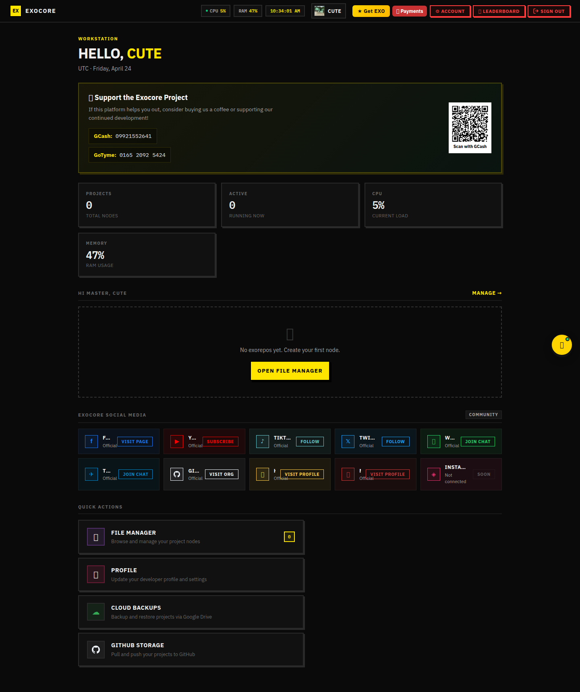
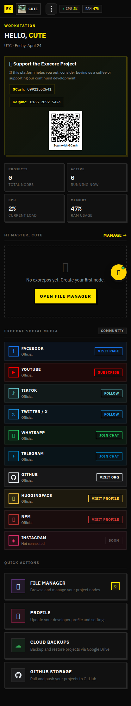

# Editor / IDE — `/exocore/editor`

The Exocore IDE is a full Monaco-and-CodeMirror powered code editor with file
explorer, integrated terminal (xterm + node-pty), package managers, AI
assistant, GitHub pane, Drive pane, language servers, and a webview for live
previews.

Entry point: [`client/editor/coding.tsx`](../../client/editor/coding.tsx).
Layout shell: [`client/editor/Layout.tsx`](../../client/editor/Layout.tsx).

> ⚠️ The captured screenshots show the **redirect to /login** since the
> capture run was unauthenticated. With a valid `exo_token` (and an existing
> project) the editor renders the workspace described below.

| Desktop | Mobile |
|---------|--------|
|  |  |

## Layout

```
┌─ Title bar ───────────────────────────────────────────────┐
│ Exocore · project / file path · 🔍 cmd-K · 🌗 theme       │
├─ Sidebar tabs ─────┬─ Tabs (open files) ──────────────────┤
│ ▾ Explorer (📁)    │ index.ts ✕  utils.ts ✕  README.md ✕  │
│   project tree     ├─ Editor pane ────────────────────────┤
│ ▾ NPM (📦)         │  Monaco (or CodeMirror per language) │
│ ▾ GitHub (🌿)      │  with LSP completion / diagnostics    │
│ ▾ Drive (☁)        │                                       │
│ ▾ AI (🤖)          │                                       │
├──────────────────  ├─ Bottom panel ───────────────────────┤
│                    │ [problems] [console] [terminal] [webview]
└────────────────────┴───────────────────────────────────────┘
                Status bar — git branch · LSP · runtime · cursor
```

`SidebarTab = 'explorer' | 'npm' | 'github' | 'drive' | 'ai'`
`BottomPanel = 'problems' | 'console' | 'terminal' | 'webview' | 'none'`

## Sidebar tabs

| Tab | Component | What it does |
|-----|-----------|--------------|
| **Explorer** | `Sidebar.tsx`         | Tree view, drag-and-drop, context menu, multi-select |
| **NPM**      | `NpmPane.tsx`         | Search npm, install / uninstall, see installed deps |
| **GitHub**   | `GithubPane.tsx`      | See [GitHub docs](../github/README.md) |
| **Drive**    | `GDrivePane.tsx`      | Pick / upload from Google Drive |
| **AI**       | `ExocoreAI.tsx`       | Chat assistant with file/terminal tool-use |

There is also an extensible "Packages" group (`PackagesPane.tsx`) that hosts
**Python pip** (`PyLibrary.tsx`), generic registries (Cargo, gem, pkg via
`GenericPackagePane.tsx`).

## Bottom panels

| Panel    | Source             | Notes |
|----------|--------------------|-------|
| Problems | LSP diagnostics    | grouped per-file, click to jump |
| Console  | `ConsolePane.tsx`  | runtime stdout / stderr |
| Terminal | `KittyTerminal.tsx`+`xterm` | pty-backed, supports tabs |
| Webview  | `Webview.tsx`      | proxied iframe of the running project |

## Languages

`editor/language.tsx` registers Monaco grammars + CodeMirror extensions for:

- TypeScript / JavaScript (with JSX)
- Python · PHP · Rust · C · C++
- HTML · CSS · JSON · Markdown
- Plus syntax highlight via Prism for less common languages
  (Go, Ruby, YAML, TOML, SQL, Shell, …) inside chat code blocks.

LSP bridge: WebSocket to `routes/editor/_lspBridge.ts`, which spawns the
appropriate language server (`pyright`, `tsserver`, `rust-analyzer`,
`clangd`, …) per project.

## Command palette

`Ctrl + K` opens [`CommandPalette.tsx`](../../client/editor/CommandPalette.tsx)
with fuzzy-search across files, commands, settings, and AI prompts.

## AI assistant

Two-pane component (`ExocoreAI.tsx`):

- **Chat** — ChatGPT-style stream with code-blocks, file-attach, and
  "apply this diff" button.
- **Setup** — pick provider (Exo-built-in / OpenAI / Anthropic / OpenRouter)
  via [`ai/ExoSetupPanel.tsx`](../../client/editor/ai/ExoSetupPanel.tsx) +
  [`ai/RestSetupPanel.tsx`](../../client/editor/ai/RestSetupPanel.tsx).

Server bridge: [`routes/editor/ai.ts`](../../routes/editor/ai.ts) (proxies to
the configured provider, streams SSE back).

## Mobile layout

On viewports `< 720 px` the sidebar collapses behind a hamburger and the
bottom panel becomes a full-screen sheet with a 4-button bottom nav
(`m-nav-btn`): Problems · Console · Terminal · Webview.

## Backend routes

| Route                                | Source |
|--------------------------------------|--------|
| `/exocore/api/editor/coding`         | File CRUD |
| `/exocore/api/editor/runtime`        | Spawn / stop project process |
| `/exocore/api/editor/shell`          | WS pty bridge for the terminal |
| `/exocore/api/editor/npm`            | Search / install npm |
| `/exocore/api/editor/pylib`          | pip equivalent |
| `/exocore/api/editor/deps`           | Cross-package summary |
| `/exocore/api/editor/templates`      | Template catalog |
| `/exocore/api/editor/github`         | Git ops |
| `/exocore/api/editor/gdrive`         | Drive picker |
| `/exocore/api/editor/ai`             | AI proxy |
| `/exocore/api/editor/projects`       | Project CRUD |
